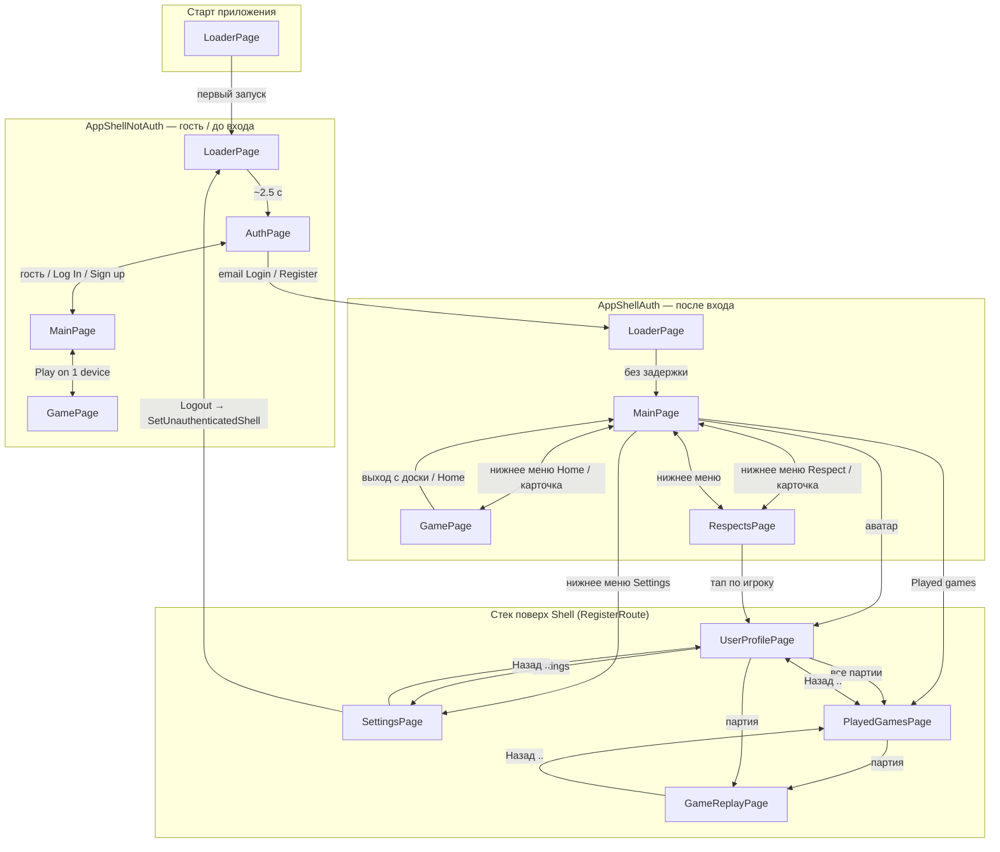

# SigmaChess — навигация (текущее состояние)

**Схема в браузере:** откройте [docs/navigation-diagram.html](docs/navigation-diagram.html) (двойной щелчок или Chrome/Edge).

Схема отражает **реальный код** на данном этапе (обновлено: два Shell, push-маршруты, без цепочки Respects–Settings–Profile). В приложении два разных Shell; страницы из нижнего меню доступны не везде.

## Диаграмма (авторизованный пользователь)

После входа по email/паролю вызывается `SetAuthenticatedShell()` → `AppShellAuth`.

## Условные переходы

| Подпись | Условие | Куда |
|--------|---------|------|
| **מחובר** (как на вашем чертеже) | Только `AppShellAuth` после `SetAuthenticatedShell` | `LoaderPage` → `//MainPage` (без ожидания 2.5 с) |
| **התנתקות** (выход) | `SettingsViewModel.LogoutCommand` | `PerformFullLogoutAsync` → новый `AppShellNotAuth` (снова Loader → Auth) |
| Гость на Respect / Settings / Played games | `AppShellNotAuth` + `GuestRestrictedRoutes` | Попап «Account required» → `AuthPage` |

## Чем отличается от вашего чертежа

| На схеме в отчёте | В проекте сейчас |
|-------------------|------------------|
| `RespectsPage` ↔ `SettingsPage` ↔ `UserProfilePage` в один ряд | **Нет:** Settings — с нижнего меню или из профиля; профиль — с Main / Respect / поиска |
| `Loader` → сразу между Main и Game при «מחובר» | **Частично:** только в `AppShellAuth`, не при гостевом `AppShellNotAuth` |
| `RespectsPage` у всех | **Только** в `AppShellAuth`; гость видит Respect на Main, но уходит на Auth |
| Линейная цепочка Profile → Played → Replay | **Да**, но Played games также открывается с `MainPage` |

## Файлы

- Shell: `AppShells/AppShellNotAuth.xaml`, `AppShells/AppShellAuth.xaml`
- Маршруты стека: `App.xaml.cs` → `RegisterShellRoutes`
- Нижнее меню: `Services/UiShellHelpers.cs` → `BottomNavigationCoordinator`
- Смена Shell: `App.SetAuthenticatedShell` / `SetUnauthenticatedShell`

**Менять код под старую схему не требуется**, если цель — описать проект «как есть». Если нужно **привести навигацию к чертежу из отчёта** (линейка Respect–Settings–Profile и т.д.) — это отдельная задача по UX.
